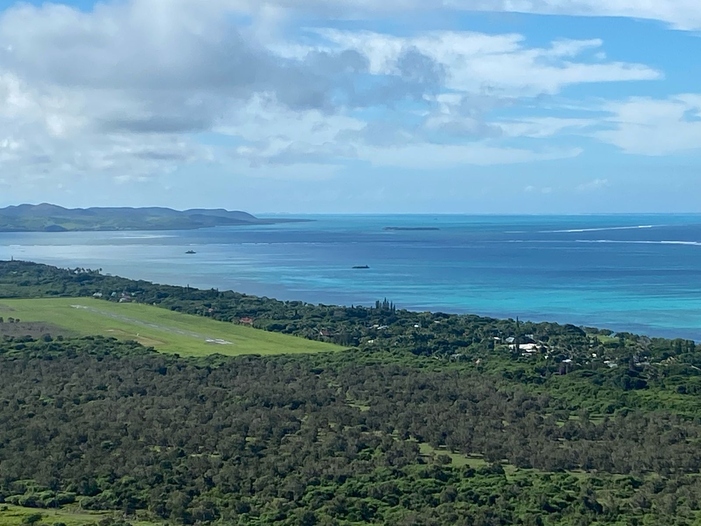

# An interactive webmap for SOCPacific2R 

Nathan LAFONT & Samuel MARTIN 

---

## DISCLAIMER

This website has been developed by the named authors. If you contribute to improving the website by editing this folder and/or its files, please add your name as a contributor on the edited sheets and on the top of this document.

## DESCRIPTION

This document is meant for technical details about the website and webmap architectures. If you are seeking further information about SOCPacific2R or this webmap project, please head to [socpacific.link](https://socpacific.link/) or to this [project report](./documents/2025_LAFONT_MARTIN.pdf).

## FOLDERS AND ARCHITECTURE

> General notes

|**C1** | **C2** | **C3** | **C4** | **C5** | **C6** |
|:----------------------------|:--------------|:------------------|:------------------|:-----------|:------------| 
|  |  |  |  |  |  |
|  |  |  |  |  |  |

## PAGES & FILES

1. `index.html`: all the website revolves around this unique page (except for mobile phones). Additional pages are from other websites (mainly [socpacific.link](https://socpacific.link/)) or are automatically generated by the browser.
    `index.html` is segmented into 4 sections: `id="webmap"`, `id="contact"`, `id="credits"`, `id="footer"`. The main one is the webmap section gathering introduction and detailed texts and the webmap. In this section, the code is segmented by comments. 

2. `html/mobile_map.html`: this page is only meant for mobile functions. It only displays a full-screen webmap with a specific id that allows `javascript/map.js` to set differentiated values to make the webmap more user-friendly on mobile phones.
   
3. `javascript/map.js`: mainly defines the webmap, its layers and features (pop-up panels, layerswitcher, etc.). Also gathers the code for a few quality of life upgrades such as the location selector or the full-screen view. 

## HOW TO EDIT...

